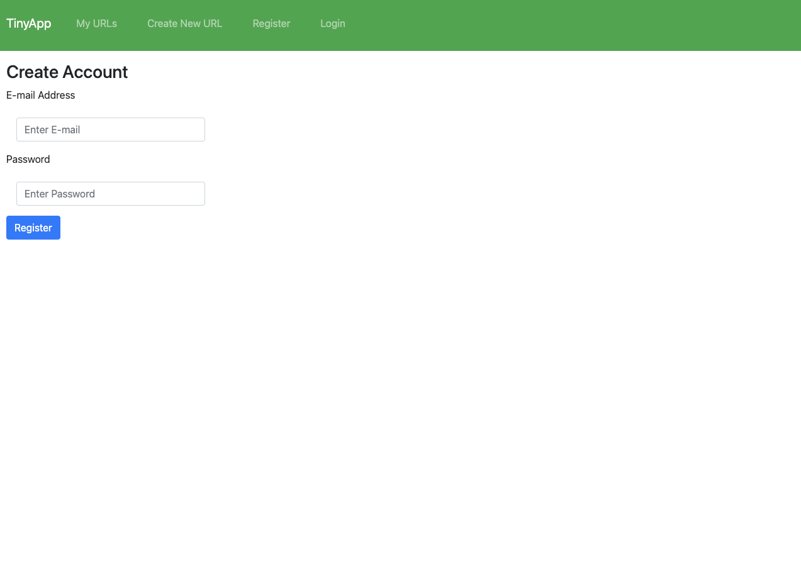
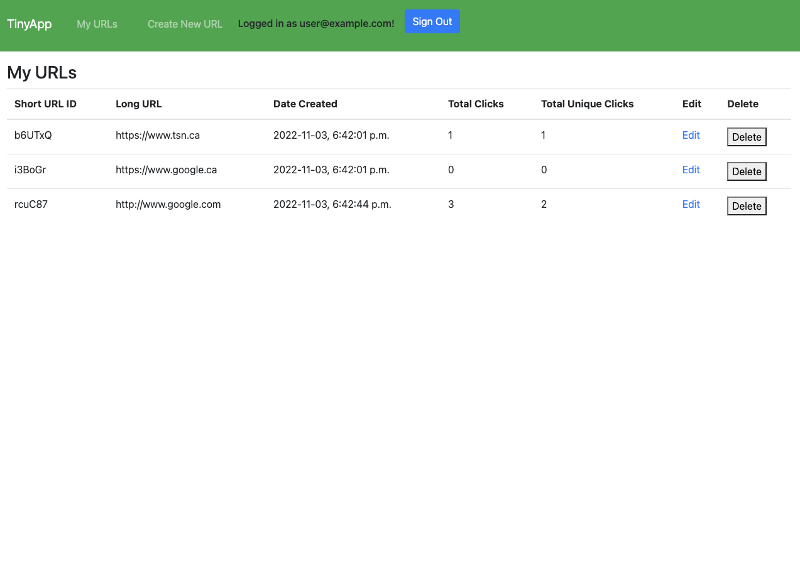
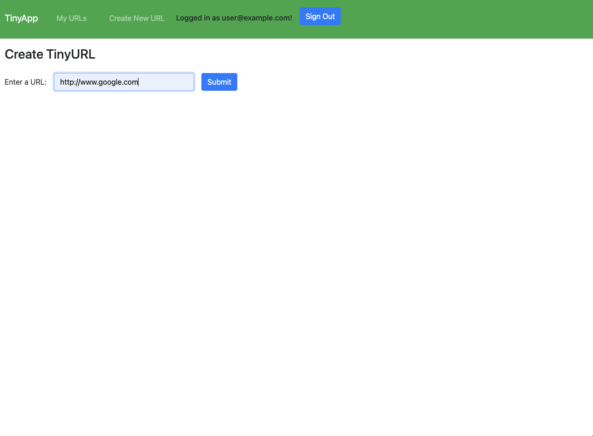
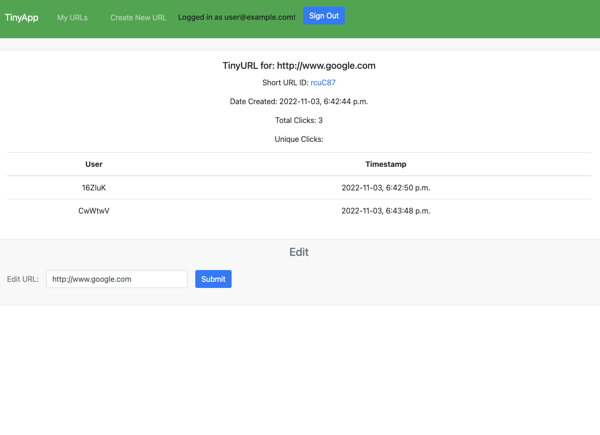

# TinyApp Project

TinyApp is a full stack web application built with Node and Express that allows users to shorten long URLs (à la bit.ly).

## Final Product

#### Login Screen

#### URL Index

#### Create a new URL

#### Edit an URL

## Dependencies

- Node.js
- Express
- EJS
- bcryptjs
- cookie-session
- method-override

## Getting Started

- Install all dependencies (using the `npm install` command).
- Run the development web server using the `npm start` command.

## Features

A logged in user can create a new Tiny URL for a full length URL. This Tiny URL would be able to be sharedand when clicked, open the original long URL. Users can see all of their created Tiny URLS, edit and delete them. The application also tracks how many times each Tiny URL has been clicked and how many unique clicks. These stats are summarized on the URL Index page and can be viewed in detail on the edit page. 